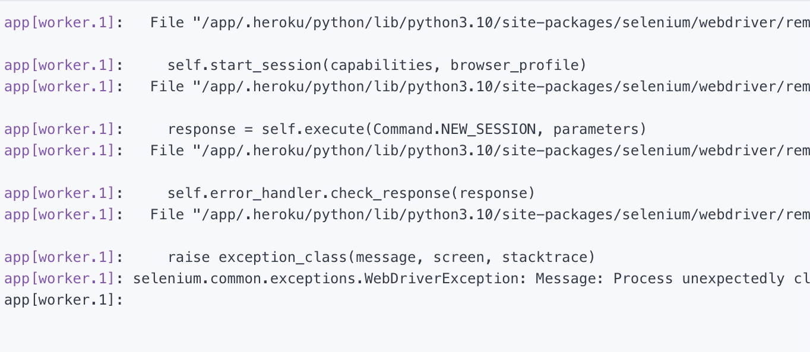

This telegram bot that I coded from scratch takes in a command such as ```/address ${town} ${lastname}``` and outputs the address and full name of the resident, taken from a database updated daily. 

So far, it only works in towns in Connecticut. In the future weeks, I'll likely update it to work nationwide, and then I'll start adding reverse-address capabilities so you can input an address. Feel free to [contact me](/contact) and suggest features.

The source code is really interesting to look at and I wouldn't want complete public access to the methods I'm using so it's hosted on [gumroad](https://grahamzemel.gumroad.com/l/TelegramBot). I'll be happy to implement customized features and modify the code for those who already have the files. 

I used a few different services for hosting and such, plus different tools from Heroku and Python. If you're into neat cybersecurity stuff, I recommend automating different processes with Telegram bots, it's a lot of fun. 

