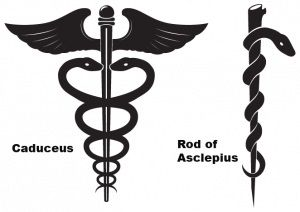
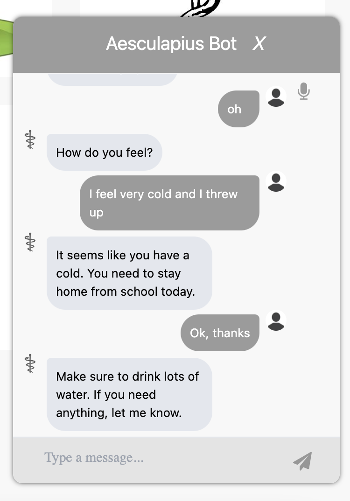

The winning project for the healthcare track in the MetroHacks 2022 hackathon. A 24 hour project based on furthering healthcare accessibility made with Svelte, Tailwind, Typescript, and a custom Co:here AI chat bot. Web app made from <strong>Svelte</strong>, <strong>Tailwind</strong>, <strong>TypeScript</strong>, and utilizing a <strong>custom AI bot</strong> using <Link href='https://cohere.ai/'>Co:here</Link> natural language processing. 

Aesculapius, the Greco-Roman god of medicine, was the name of our healthcare centered project for obvious reasons. The Rod of Aesculapius can be seen below, but make note that it is <strong>NOT</strong> the Caduceus. That's Herme's (Greek god of messengers/travel) rod. 

This website was a ton of fun to make, and I created it with three other programmers. They all worked mostly on the bot and a few neat API features, like having the bot <strong>call an ambulance</strong> and/or <strong>text an emergency number</strong> if you said something that presented an immenent danger. I did the full web app, a bunch of the write-up, and made sure we didn't cut any corners.

For example, if you were talking to our bot either on the widget from the <Link href='https://aesculapius.tech'>website</Link> or from it's phone/text number at <strong>(940) 217-2964</strong>, it could detect if the user mentioned something about <strong>self harm</strong> and would send a special text to an emergency number on file. 

We also added the potential capabilities for getting directions to the three nearest hospitals, adding a news API for current healthcare news, and getting live medication information.

 
If you'd like to see our project on the Devpost website where it won MetroHacks 2022 (375+ participants), check it out <Link href='https://devpost.com/software/aesculapius'><strong>here</strong></Link>.

