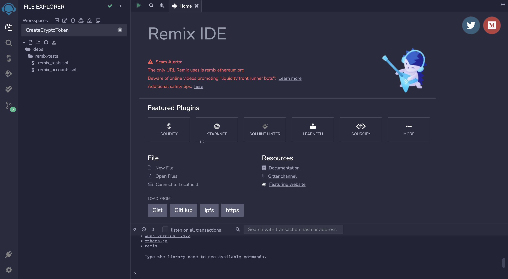

This project was created as a template for web3 developers to build custom cryptocurrencies on the ERC20 blockchain. 

It was a really neat process to create my own cryptocurrency, and I really enjoyed it. I wanted to share the code with others in case they wanted to do something similar, and the instructions are inside of the <Link href='https://github.com/grahamzemel/CreateCryptoToken'>Github repo</Link> for those who would like to use it. 

You can modify the code any way you want, and it may take a little bit of tinkering on the REMIX IDE website which is where everything will be deployed and created.

Once you create a token, you'll need to manually suggest/post it onto token listing websites. If you popularize it enough, you might start to see people investing and that sort of things and it's very cool to see something you created gain value like that. 

Some sites to list your tokens on for free:  

Right when you start out I'm pretty sure it's automatically listed: <Link href='https://poocoin.app/'>Poocoin</Link>  
Important for liquidity and smaller token/coin trading: <Link href='https://pancakeswap.finance/'>PancakeSwap</Link>  
If you gain a good following and it becomes fairly popular: <Link href='https://coinmarketcap.com/'>CoinMarketCap</Link>  

