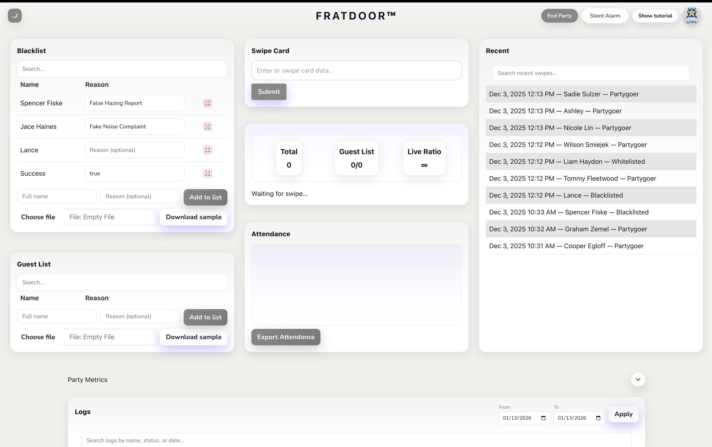

  <strong>FratDoor</strong> is a door-check system for events that replaces paper lists with a fast, structured check-in flow.
  It helps hosts track attendance, make consistent entry decisions, and maintain a clear record of who entered and when.

<strong>What it’s built for</strong>

<ul>
  <li><strong>Rapid check-ins</strong> with a clean, repeatable workflow at the door.</li>
  <li><strong>Allow/Deny controls</strong> (whitelist/blacklist) to support quick decisions under pressure.</li>
  <li><strong>Timestamped logging</strong> so each entry produces an audit-friendly arrival record.</li>
</ul>

  The result is a more accountable process that’s easier to run during peak entry.

<strong>Website:</strong> <Link href='https://fratdoor.com'>fratdoor.com</Link>

