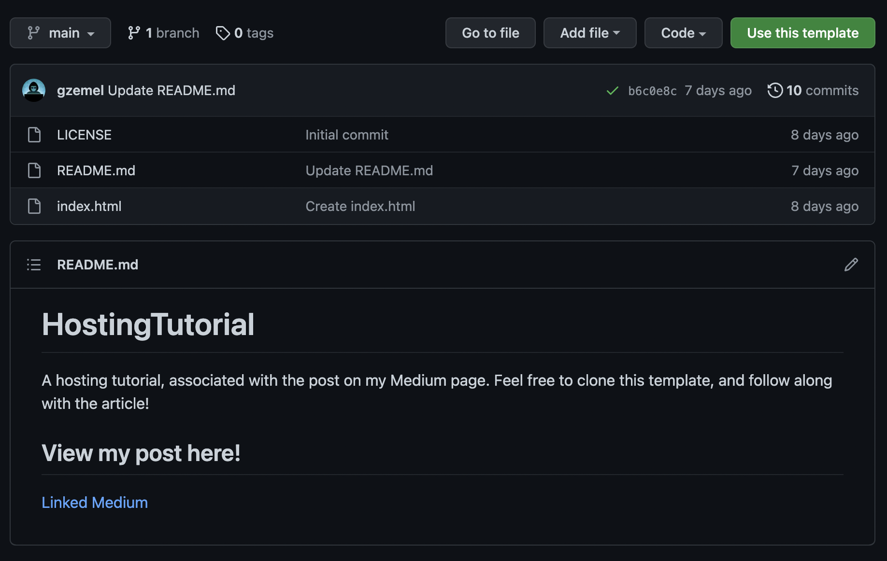

This is a simple, barebones template repository that is intended for use with my post on [creating your own portfolio website](https://medium.com/the-gray-area/creating-a-personal-portfolio-website-an-in-depth-guide-for-beginners-7155a785bfb3)

This was a really fun post to write because I tried to make it as detailed as possible, that way anyone could follow it. Even if you weren't a programmer and wanted to host achievements of some sort or cool videos. I found the easiest way to get a website with your name on it (like grahamzemel.com) and then upload your own files to it as a portfolio type site. 

That post doesn't have any advanced code in it, it's just a simple index.html file that will display some text when you host it.

If you'd like to make your website look nice and polished, or even just upload some template code, for beginners I suggest going over to Github and searching for some neat portfolio website templates. Or, you're welcome to use this website which I created and modify it, just be sure to give credit if you do and leave the copyright in the sidebar. 

If you're a moderately-skilled or better developer, I suggest coding a site yourself (yes, it's a lot of work but worth it), or go to [awwwards.com](https://www.awwwards.com/) for some inspiration.