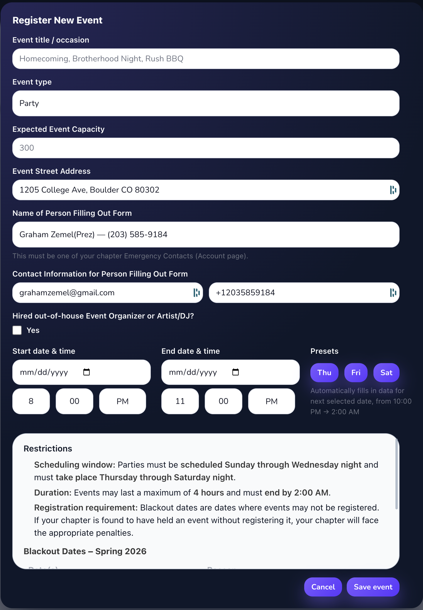

  <strong>IFC EventHub</strong> centralizes event registration for IFC on-the-Hill chapters—bringing party and rush submissions,
  key logistics, and safety workflows into one consistent system.

<strong>Key highlights</strong>

<ul>
  <li><strong>Event registration</strong>: submit parties, rush events, and required details in a single place.</li>
  <li><strong>Notifications</strong>: email updates to the right stakeholders when events are submitted or changed.</li>
  <li><strong>Emergency contacts</strong>: store and surface contact info when it matters.</li>
  <li><strong>Compliance support</strong>: structured fields that make coordination and policy adherence easier.</li>
</ul>

  Designed to reduce back-and-forth while improving visibility and consistency across chapters.

<strong>Website:</strong> <Link href='https://ifceventhub.netlify.app/'>ifceventhub.netlify.app</Link>

