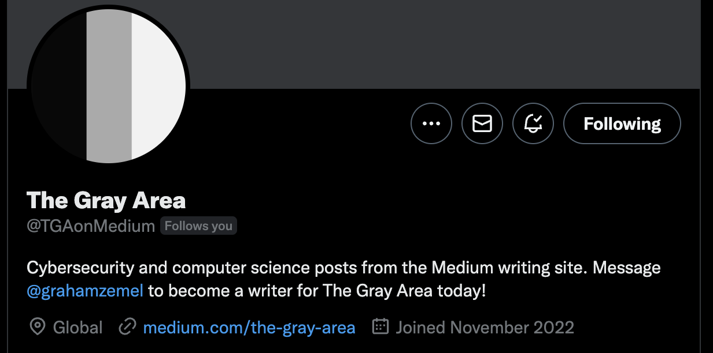

A quick and fun automation bot that posts each new article from my publication, <Link href='https://medium.com/the-gray-area'>The Gray Area</Link> , onto Twitter. It requires no user interaction on my part, all I have to do is publish the article. 

It utilizes Medium's RSS feed, as it doesn't have an official API. The RSS feed updates often enough that I can pull it every so often, check if the data is modified, and if it is, post the new article that was appended to the RSS feed.  

Everything gets parsed into JSON using 'rss2json', and then it's just figuring out how I want to post things like hashtags. It's hosted on Heroku and you can view it on Twitter <Link href='https://twitter.com/TGAonMedium'>here</Link> . 

It was a bunch of fun to program, and I love automation bots because they give you the means to accomplish more in a far shorter span of time, and strive for even greater accomplishments because of the time saved. 

Here's the Github <Link href='https://github.com/grahamzemel/MediumTwitterBot'>source code</Link> , and <Link href='https://medium.com/the-gray-area/creating-an-automated-twitter-bot-for-medium-100-lines-of-code-53e056e6b0de'>the Medium article</Link> I published on it. 

