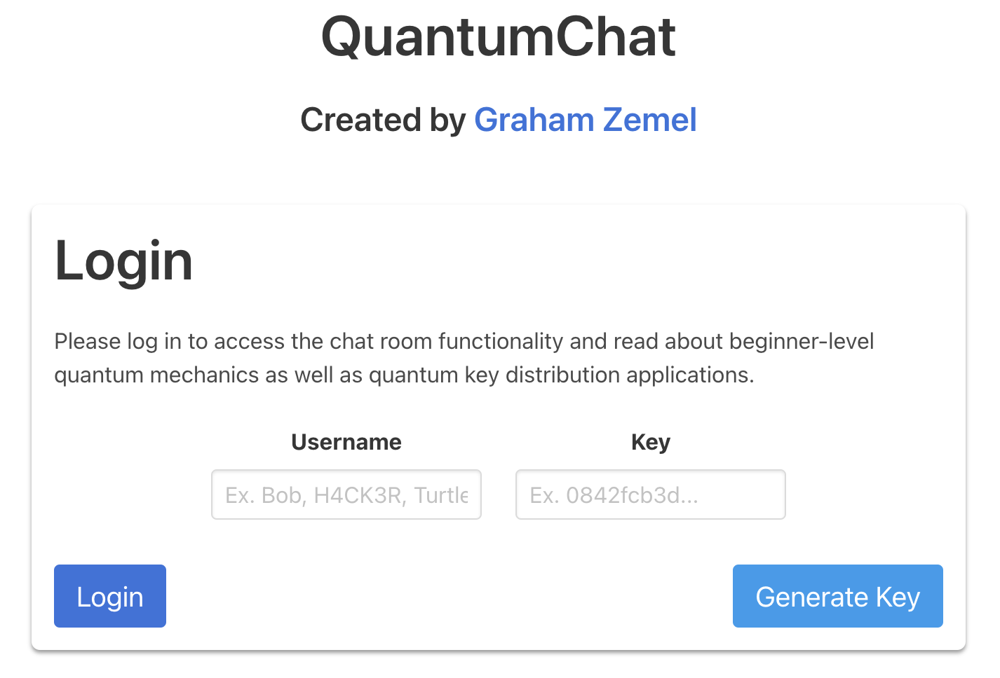

This project is a <strong>quantum chat room</strong> that uses <strong>quantum key distribution</strong> to encrypt any traffic sent between users. It's built with <strong>Svelte</strong> and <strong>Python</strong>, and it's a <strong>fully functional chat room</strong> that also includes information about the quantum key distribution process, and how it works. The main chat page includes helpful videos and code explanations to help you understand how your data is secured while using the chat room.

This was my first project utilizing quantum cryptography (and my first quantum computing project in general), and I learned a lot about the process of quantum key distribution while building it. Here are a few key features:

- <strong>Quantum Key Distribution (QKD)</strong>: to encrypt messages sent between users, no traffic is ever exposed on the internet and everything is encrypted from the second you send a message up until the chat room displays the decrypted message (without ever exposing sensitive information to databases or the internet).
- <strong>Multi-User Support</strong>: Any amount of users can join the chat room and chat in real time with each other. 
- <strong>Instant, Comprehensive Deletion</strong>: Any user of the chat room can delete the key and it's corresponding message history for all users at any time, so make sure to keep it secure (just like a password)!
- <strong>Automated Key Expiry</strong>: If no users delete the chat room (key) after one month, it will self destruct and invalidate the key permanently for all users, deleting all messages and data permanently. This is to ensure that no one can ever access the key or messages after the chat room has been abandoned.
- <strong>QKD Basic Information</strong>: The chat room includes a "How It Works" section to describe QKD and the BB84 protocol, as well as a "Why Use QKD?" section to explain the benefits of using QKD over traditional encryption methods. It includes a video on the No-Cloning Theorem, which is the basis for QKD and quantum cryptography in general, as well as a lengthy beginner-level explanation of the QKD code used in the chat room's encryption process.

Access it here: <Link href='https://timely-cascaron-5a6155.netlify.app'>QuantumChat</Link> !

