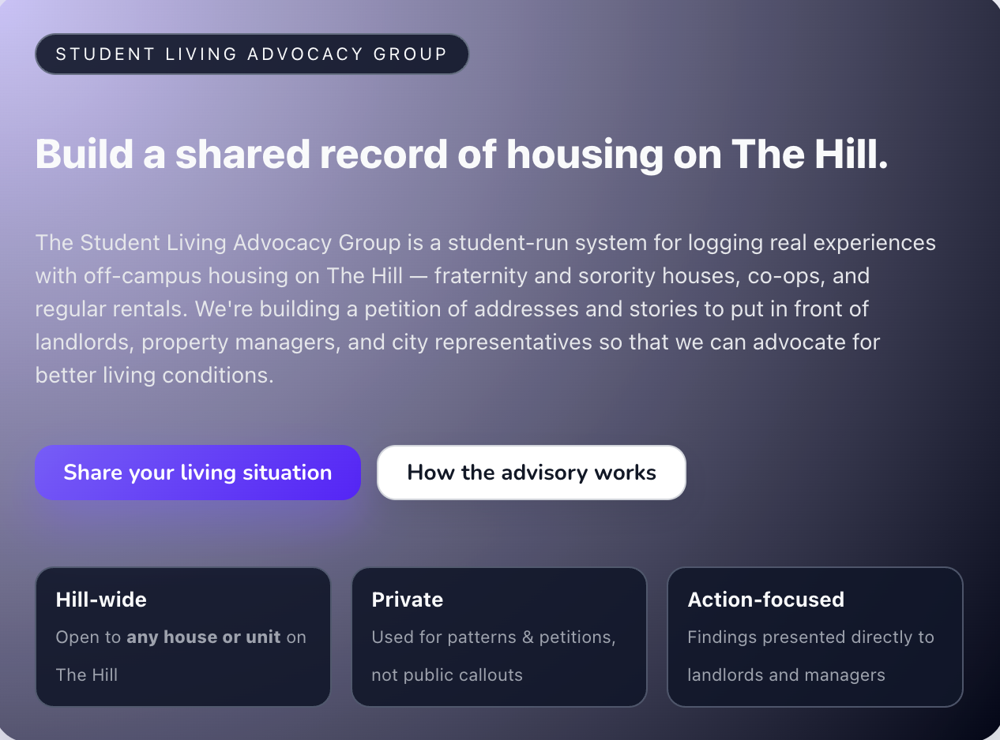

  <strong>Student Living Advocacy Group</strong> is a student-run reporting hub for off-campus housing on the Hill in Boulder.
  It creates a shared record of real living conditions and resident experiences—so patterns are visible, not isolated.

<strong>What it enables</strong>

<ul>
  <li><strong>Experience logging</strong>: document issues, conditions, and outcomes in a consistent format.</li>
  <li><strong>Aggregation for advocacy</strong>: roll up reports to support requests for repairs, accountability, and change.</li>
  <li><strong>Neighborhood focus</strong>: centered specifically on Hill-area off-campus housing.</li>
</ul>

  The goal is simple: make student housing realities easier to document, understand, and improve.

<strong>Website:</strong> <Link href='https://hillneighborhoodslag.netlify.app/'>hillneighborhoodslag.netlify.app</Link>

