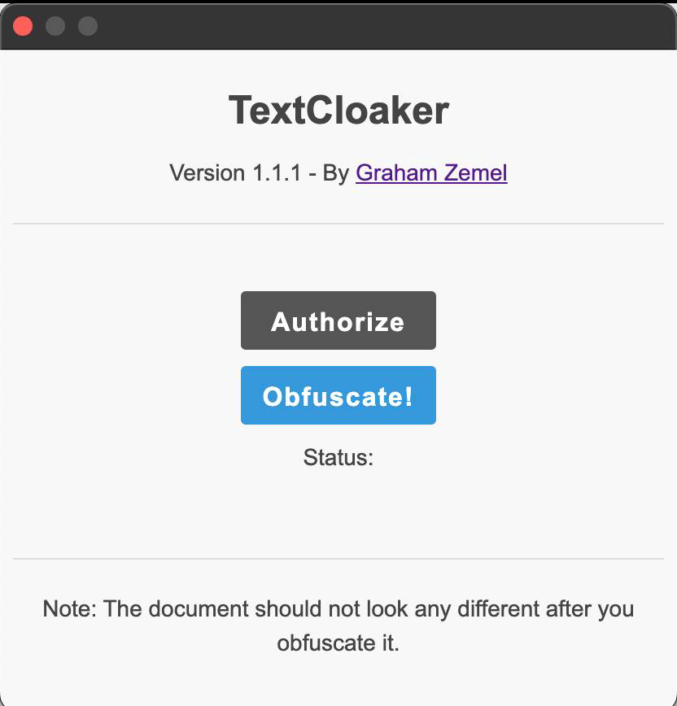

A Google Extension to cloak your AI-generated text from those nosy detectors! 100% effective, free, and fast. Privacy Policy <Link href='https://grahamzemel.com/privacypolicy.html'>here</Link> .

This is a neat project I made that inserts specific invisible characters into text with Google Docs APIs, and alters it so that AI detectors will not parse the document properly. As a result, any AI detector will identify the document as being written <strong>entirely by a human</strong>, as tested on <strong>ZeroGPT</strong>, <strong>CopyLeaks</strong>, and many more.

