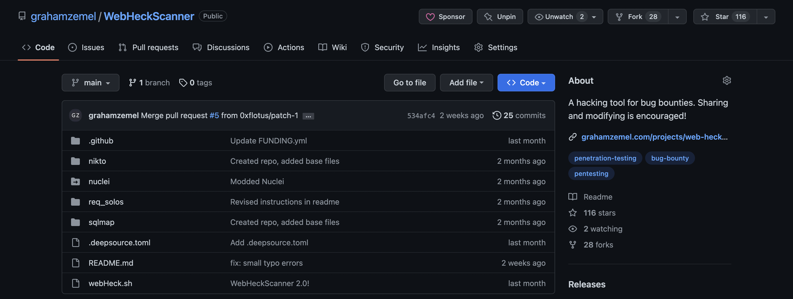

A hacking tool built for the bug hunters, [Web Heck Scanner](https://github.com/grahamzemel/WebHeckScanner) is a compilation of 3 popular hacking tools and 5 components that hands you bugs on a silver platter. 

This was one of my favorite tools to build, and I learned a bunch of Bash while creating it. It's got tools like sqlmap, Nuclei, Nikto, and much more.

It seems to be pretty well liked, feel free to fork it and build your own version.

Read up on what it does and how it's helped me as a bug bounty hunter [here](https://medium.com/the-gray-area/finding-p1-vulnerabilities-tools-resources-32bb2e7a52fb).

